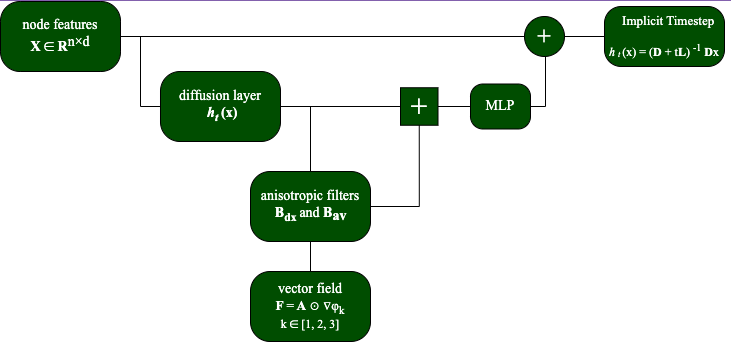

# Graph Augmented Anisotropic Diffusion

The implementation of master's thesis based on the paper [***Graph Anisotropic Diffusion***](https://arxiv.org/abs/2205.00354) using PyTorch and PyTorch Geometric libraries. 
This project specifically focused on investigating the benefits of introducing an eigenvectors of Laplacian matrix to improve message transferring during aggregation in the GAD model. 
We showed that in spectral clustering of dynamic zones within molecules, it's important to use not just the Fiedler's vector but also the next eigenvectors, see visualisation.
Using these extra eigenvectors improves the model's predictive ability.

## Description 
This repository is structured in the following manner:
* [src](GAD/src) : contains the scripts to create Graph Anisotropic Augmented Diffusion model, including diffusion layer, aggregation matrices, GAD_layer, and full architecture for 3 eigenvectors model. The architecture for 2 eigenvectors in the next to this branch. 
* [experiments](GAD/experiments/ZINC) : contains the scripts to generate our results on molecular property prediction benchmarks.
